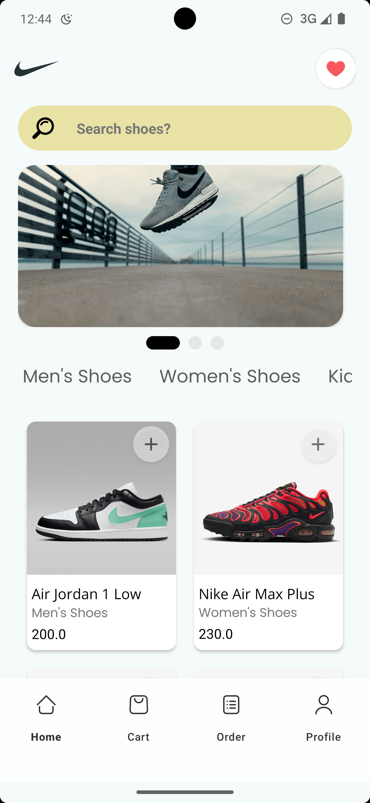
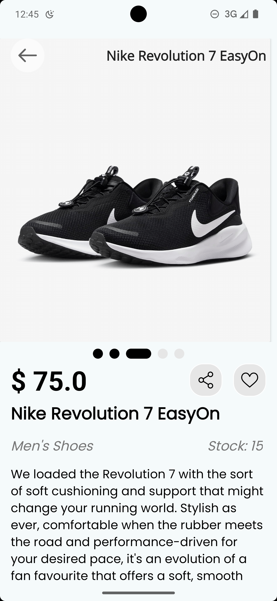
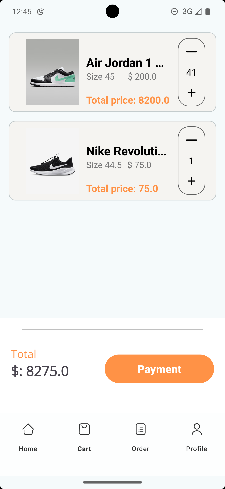
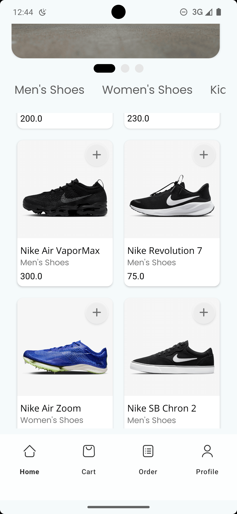
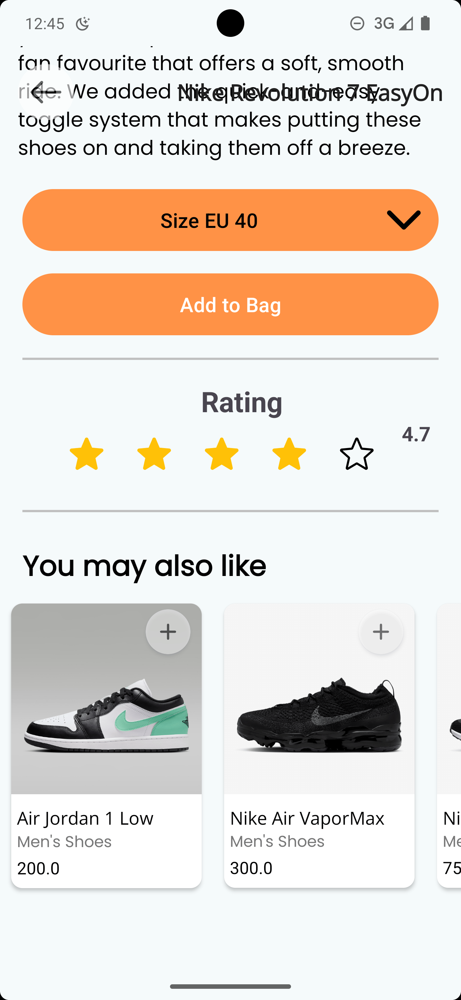

# Shoes Shop

Shoes Shop là một ứng dụng mua sắm giày trực tuyến được xây dựng bằng Kotlin và Java.

   
## Tính năng

- Đăng nhập và đăng ký tài khoản.
- Xem danh sách các sản phẩm giày.
- Xem chi tiết sản phẩm giày.
- Thêm sản phẩm giày vào giỏ hàng.
- Xem và chỉnh sửa giỏ hàng.
- Thanh toán đơn hàng.
- Xem lịch sử đơn hàng.
- Đăng xuất tài khoản.
- Tìm kiếm sản phẩm giày.

## Cài đặt

Đảm bảo bạn đã cài đặt Android Studio và JDK trên máy tính của bạn.

1. Clone repo này về máy tính của bạn.
2. Mở Android Studio và chọn `Open an existing Android Studio project`.
3. Chọn thư mục vừa clone và nhấn `OK`.
4. Đợi cho Gradle hoàn tất việc tải và build project.
5. Chạy ứng dụng trên emulator hoặc thiết bị thật.

## Công nghệ sử dụng

- Ngôn ngữ: Kotlin
- Framework: Android SDK
- Thư viện: Retrofit, Glide

## Backend API

Ứng dụng này sử dụng API được xây dựng bằng React.js và Mongoose DB. Mã nguồn của API có thể được
tìm thấy tại [đây](https://github.com/nqmgaming/shoes-shop-api).

## Tác giả

- [nqmgaming](https://github.com/nqmgaming)

## Giấy phép

Được phân phối dưới giấy phép MIT. Xem file `LICENSE` để biết thêm chi tiết.